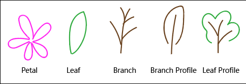
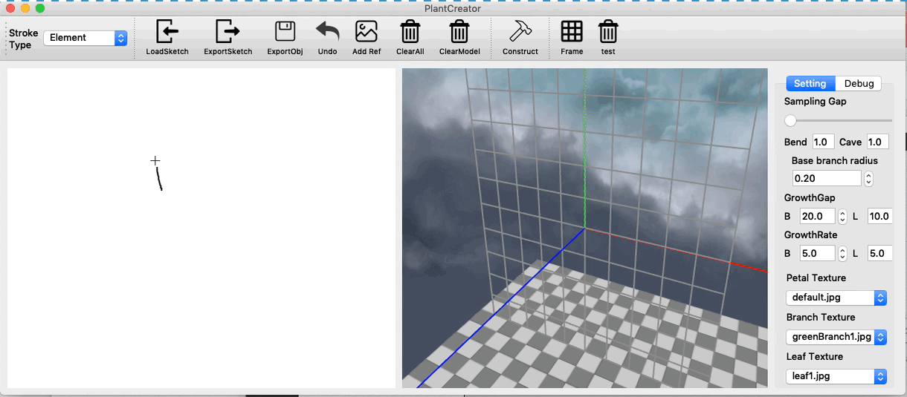
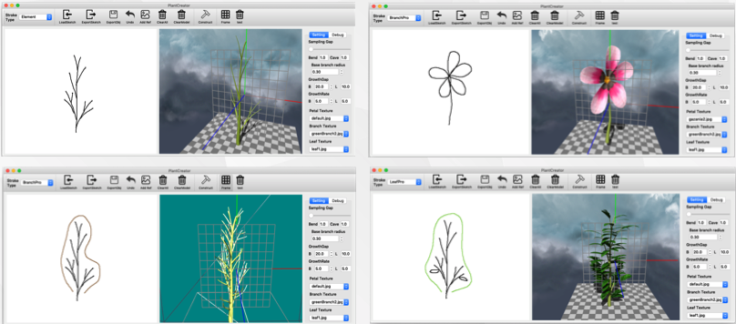
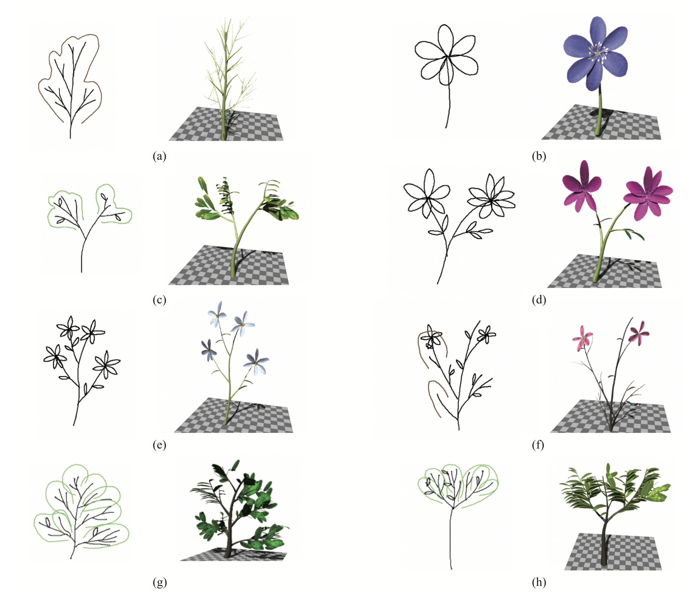
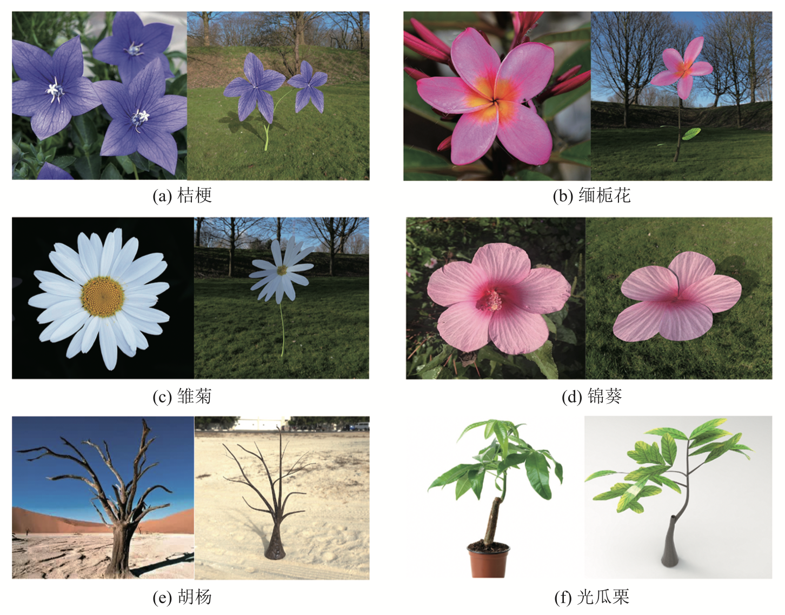

### PlantCreator


PlantCreator is an  implementation of my bachelor thesis -- *sketch-based fast plant modeling*. The user can create 3D plant models with a few sketch strokes by using PlantCreator. PlantCreator is written in C++ using Qt and an OpenGL rendering framework which is proudly powered by [HJGraphics](https://github.com/m-iDev-0792/HJGraphics).

PlantCreator can generate a plant model from a sketch which consists of file kinds of stroke elements: leaf, petal, branch, leaf profile and branch profile.



The user is supposed to draw each element in **one** single stroke. Of course, there is also an undo option for user since not everyone is able to draw every stroke perfectly.

Once sketch is completed, click the ```construct``` button and a plant model is on the screen. Feel free to export your model in OBJ format for further use!

**Demo:**








**Real plant photos vs model rendering results:**



See thesis.pdf for more detail.
