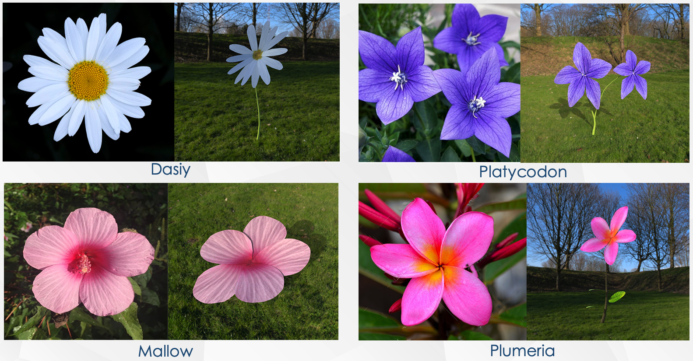

### PlantCreator


PlantCreator is an  implementation of my bachelor thesis -- *Sketch-based fast plant modeling*. User can create 3D plant models with a few sketch strokes by using PlantCreator. PlantCreator is written in C++ using Qt and OpenGL rendering framework is proudly powered by [HJGraphics](https://github.com/m-iDev-0792/HJGraphics).

PlantCreator can generate plant model from a sketch which consists of 5 kinds of stroke elements: leaf, petal, branch, leaf profile and branch profile.


User is supposed to draw each element in **one** single stroke. Of course, there is undo for user since not everyone is able to draw every stroke perfectly.

Once sketch is completed, click ```construct``` button and a plant model is on the screen. Feel free to export your model as OBJ format for further use!

**Demo:**


**Real plant photo vs model rendering result:**



See thesis.pdf for more detail.